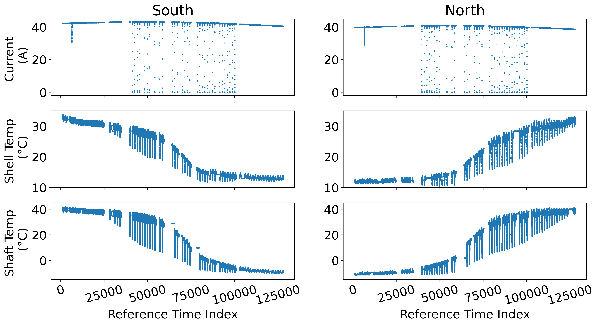

# Tutorial: How to Use the Foundation Time Series Model

This tutorial will guide you through installing, configuring, and applying the Foundation time series model for forecasting time series data.

We first focus on the SADA data time series modeling.


*Figure 1: SADA measurement Over 201909 Eclipse*

### Prerequisites
Before you begin, ensure you have the following tools installed:
- Python 3.8+
- Libraries: `pandas`, `numpy`, `matplotlib`, `scikit-learn`, details can be found in the requirements.txt.

Install these dependencies by running:

```bash
pip install pandas numpy matplotlib scikit-learn
```

### 1. Installing Foundation Time Series Model

First, you need to install the Foundation models. Here we utilize the ['Moirai'](https://arxiv.org/abs/2402.02592) as the implemented focus and clone its repository from the model's official GitHub repository:

```bash
git clone https://github.com/SalesforceAIResearch/uni2ts.git
cd uni2ts
virtualenv venv
. venv/bin/activate
touch .env
pip install -e '.[notebook]'
```

It seems it is also available through pip now, so you can install it directly:
```bash
pip install uni2ts
```


### 2. Preparing Dataset

Typically, prepare a DataFrame where:
- The index is a `DatetimeIndex` with defined consistent frequency 
- Columns represent different variables or features of the time series.
- Rows represent different timesteps' measurements

### Load your data (make sure the Date column is parsed as a datetime object)
```
df = pd.read_csv('sada.csv', index_col='ds', parse_dates=True) ### features has been normalized
```

### Display the first few rows
```
print(df.head())
```

SADA data should look like this:
```
	IN17	TK36	TK38	IN7	TK37	TK39
ds						
2019-02-03 00:00:00	42.176	32.722000	39.529000	39.640	11.322	-11.234
2019-02-03 00:01:00	42.176	32.722000	39.529000	39.640	11.322	-11.234
2019-02-03 00:02:00	42.176	32.722000	39.529000	39.640	11.322	-11.234
2019-02-03 00:03:00	42.176	32.722000	39.529000	39.640	11.322	-11.234
...
```

### 3. Configuring the Foundation Model

Foundation time series model requires specific configuration, such as the forecast horizon and feature selection. You can specify these through its parameters.

```python
import torch
import matplotlib.pyplot as plt
import pandas as pd
import numpy as np
import copy
import datetime

from einops import rearrange
from gluonts.dataset.multivariate_grouper import MultivariateGrouper
from gluonts.dataset.pandas import PandasDataset
from gluonts.dataset.split import split

from uni2ts.eval_util.plot import plot_single, plot_next_multi
from uni2ts.model.moirai import MoiraiForecast, MoiraiModule


SIZE = "small"  # model size: choose from {'small', 'base', 'large'}
PDT = 30  # prediction length: any positive integer
CTX = 30  # context length: any positive integer
PSZ = "auto"  # patch size: choose from {"auto", 8, 16, 32, 64, 128}
BSZ = 32  # batch size: any positive integer
# TEST = len(df) - 1440 * 29  # test set length: any positive integer
TEST = len(df) - 1440 * 30  # test set length: any positive integer


# Prepare model
model = MoiraiForecast(
    module=MoiraiModule.from_pretrained(f"Salesforce/moirai-1.0-R-{SIZE}"),
    prediction_length=PDT,
    context_length=CTX,
    patch_size=PSZ,
    num_samples=100, # number of samples for probabilistic forecasts
    target_dim=len(ds),
    feat_dynamic_real_dim=ds.num_feat_dynamic_real,
    past_feat_dynamic_real_dim=ds.num_past_feat_dynamic_real,
)
```

### 4. Train-test split


```python
# Group time series into multivariate dataset
grouper = MultivariateGrouper(len(ds))
multivar_ds = grouper(ds)

# Split into train/test set
train, test_template = split(multivar_ds, offset=-TEST)  # assign last TEST time steps as test set

# Construct rolling window evaluation
test_data = test_template.generate_instances(
    prediction_length=PDT,  # number of time steps for each prediction
    windows=TEST // PDT,    # number of windows in rolling window evaluation
    distance=PDT,           # number of time steps between each window - distance=PDT for non-overlapping windows
)

```


### 5. Model inference

Test the Foundation model performance on the test data.

```python
predictor = model.create_predictor(batch_size=BSZ)
forecasts = predictor.predict(test_data.input)

input_it = iter(test_data.input)
label_it = iter(test_data.label)
forecast_it = iter(forecasts)

forecast_list = []
label_list = []

len_day = 3
for i in range((1440*len_day) // PDT - 1):
    
    inp = next(input_it)
    label = next(label_it)
    forecast = next(forecast_it)
    
    if i ==0:
        label_day = copy.deepcopy(label)
        forecast_day = copy.deepcopy(forecast)
        input_day = copy.deepcopy(inp)
    
    forecast_list.append(forecast.samples)
    label_list.append(label['target'])

    print(forecast.start_date)


label_day['target'] = np.concatenate(label_list, axis=1)
forecast_day.__setattr__('samples', np.concatenate(forecast_list, axis=1))
```

<!-- ### 6. Fine-tuning 

Once the model is trained, you can make predictions for the forecast horizon.

```python
# Predict future values
predictions = model.predict(test.index)

# Compare predictions with the actual values
comparison = pd.DataFrame({'Actual': test['Close'], 'Predicted': predictions})
print(comparison.head())
``` -->

### 6. Evaluating the Model

Evaluate the model's performance using standard time series metrics such as Mean Absolute Error (MAE) or Root Mean Squared Error (RMSE):

```python
from sklearn.metrics import mean_absolute_error, mean_squared_error

mae = mean_absolute_error(gt, pred)
rmse = mean_squared_error(gt, pred, squared=False)

print(f'Mean Absolute Error: {mae}')
print(f'Root Mean Squared Error: {rmse}')
```

### 8. Visualizing the Results

Finally, plot the actual vs. predicted and resiudals values to visualize the model's performance.

```python
plt.rcParams.update({'font.size': 16})

### plot the prediction intervals
fig, axes = plt.subplots(nrows=2, ncols=3, figsize=(25, 10))
for i, ax, name in zip(np.arange(6), axes.flatten(), ['s_current', 's_shell', 's_shaft', 'n_current', 'n_shell', 'n_shaft']):
    plot_single(
        input_day,
        label_day,
        forecast_day,
        context_length=CTX,
        intervals=(0.1, 0.5),
        dim=i,
        ax=ax,
        name="pred",
        show_label=True,
    )
    ax.set_title(name)
    ax.set_xticks(ax.get_xticks())
    ax.set_xticklabels(ax.get_xticklabels(), rotation=0, ha="center")    
    xticklabels = ax.get_xticklabels()
    new_labels = [label.get_text().replace('2019-', '') for label in xticklabels]
    ax.set_xticklabels(new_labels)

### plot the exact prediction
pred = forecast_day.quantile(0.5).transpose()
gt   = label_day['target']

fig, axes = plt.subplots(nrows=2, ncols=3, figsize=(25, 10))
for i, ax, name in zip(np.arange(6), axes.flatten(), ['s_current', 's_shell', 's_shaft', 'n_current', 'n_shell', 'n_shaft']):
    ax.plot(gt[i,:], c='b', label='gt')
    ax.plot(pred[i,:], c='r', label='pred')
    xticklabels = ax.get_xticklabels()
    new_labels = [label.get_text().replace('2019-', '') for label in xticklabels]
    ax.set_xticklabels(new_labels)
    ax.set_title(name)

### plot the residual
fig, axes = plt.subplots(nrows=2, ncols=3, figsize=(25, 10))
for i, ax, name in zip(np.arange(6), axes.flatten(), ['s_current', 's_shell', 's_shaft', 'n_current', 'n_shell', 'n_shaft']):
    ax.plot(gt[i,:] - pred[i,:], c='k', label='gt-pred')
    ax.set_title(name)
```

### 9. Fine-tuning

There are three kinds of common fine-tuning techniques, i.e., partially, last-layer, and fully fine-tuning. 

```python


```

### Conclusion

This tutorial has introduced you to the basics of using the Foundation time series model. With your model trained and evaluated, you can apply it to various time series forecasting tasks.

For further reading, consult the [official documentation](https://github.com/SalesforceAIResearch/uni2ts/tree/main).

### Reference

```bash

@inproceedings{woo2024moirai,
  title={Unified Training of Universal Time Series Forecasting Transformers},
  author={Woo, Gerald and Liu, Chenghao and Kumar, Akshat and Xiong, Caiming and Savarese, Silvio and Sahoo, Doyen},
  booktitle={Forty-first International Conference on Machine Learning},
  year={2024}
}
```
